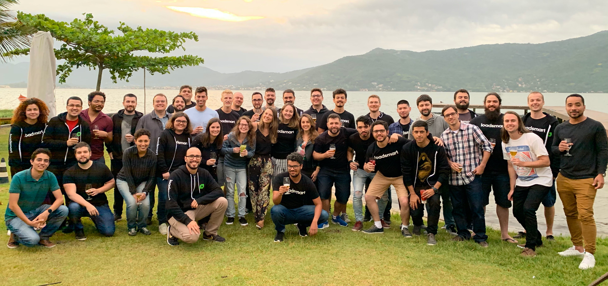

In 2014, Loadsmart was born. At that time, we had a lot of ideas around what we wanted to achieve and the products we could build to solve the many challenges facing logistics companies. We knew our impact could disrupt the industry. To this day, many logistics processes are still completed by repetitive tasks, phone calls, and an extensive list of fragmented touch points, but, thanks to the decisions we made in 2014, we are helping the industry embrace technology and understand that it is the only option to scale efficiently in 2020.

We were a small yet excited team sharing a tiny little office in New York City, on one of the busiest avenues in Midtown Manhattan. We would bump each others’ chairs a couple of times a day when coming back to our desks after a meeting or an always pleasant team lunch (we miss [Morocho](https://www.yelp.com/biz/morocho-peruvian-fusion-new-york) so much!).

Well, many things have changed since then. We grew from a team of 4 engineers in 2015 to more than 70 in 2020. We switched our tech stack (a couple of times), cloud providers, processes. We learned **tons** on this journey. And in the end, this is the reason we’re launching this blog. To share some of our tech challenges, projects, and all the cool things we have built so far.

We hope you enjoy reading our posts as much as we love writing them for you.

Thank you,  
The Loadsmart Engineering Team.

