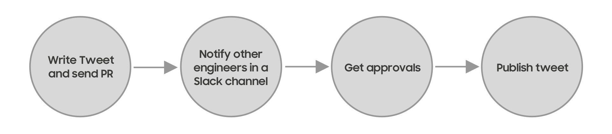

Together with [launching](https://engineering.loadsmart.com/blog/hello-world/) our blog, we have recently created (or better: _reactivated_) our Engineering team’s Twitter account. We are planning to use it as the default broadcaster for the work we do at Loadsmart. And although we may have different channels (as this blog itself is one of them) and possibly different forms of content, Twitter is great at notifying what’s new, regardless of form or platform.

One of the biggest concerns I had when we settled on the idea of sharing our work was to not let our account be managed by a single person or a small group in the company. Having specific people responsible for creating those tweets would likely create bottlenecks that could lead to lack of engagement in generating new content. And to make this initiative successful, we need to make sure content creation comes from everyone. It should be accessible to anyone willing to contribute. I believe this is what creates a collective sense of ownership.

## The problem

Twitter is a [microblogging](https://en.wikipedia.org/wiki/Microblogging) platform so I thought: "Why not having a similar experience from regular blogs where multiple authors write multiple articles?" Well, that would be nice. But unfortunately, different from regular blogs, we can only post content from a single account.

The easiest solution would be sharing the credentials, some may think. That would work, but that wouldn’t be enough. Collective ownership is also about making sure decisions are made and agreed upon. We would at least need people reviewing their peers.

## The solution

What I envisioned was a flow that would allow us to:

1. propose a new tweet
2. notify others when there’s new content to be reviewed
3. review and approve
4. publish tweet when content is approved

Because these reviewers are mostly engineers, the closer this whole process is to their natural habitat, the better. We use GitHub and Slack all day so the solution would definitely be somewhere in there.

I have used [Danger](https://danger.systems/js/) and [Peril](https://github.com/danger/peril) quite a lot in the past. They are great tools to automate many of the workflows we have, especially those involving review of Pull Requests. In fact, Loadsmart has its own set of [settings](https://github.com/loadsmart/peril-settings) that are used across many of our repositories on GitHub. But this time I decided to give GitHub actions a try.

Surprisingly, most of the things I was planning to implement were already done by [Gregor Martynus](https://github.com/gr2m) in their [twitter-together](https://github.com/gr2m/twitter-together) project. From the steps of the diagram above, the Action takes care of 1, 2, and 4. The only step missing here is the Slack notification.

There are a few Actions to interact with Slack on GitHub’s marketplace. They are all very similar to each other and most of them are not as flexible as I wanted when it comes to customization of the content for the notification. You can have this full flexibility by using Slack’s [Block Kit API](https://api.slack.com/block-kit) though, but apparently it is not possible if I have already decided to use one of the available Actions. Also, the fact that there’s no concept of "official" Actions made me think twice.

So to achieve what I had in mind, I decided to implement this one myself. I would need to create a custom action to glue all the work together anyway, passing to Slack the content of the tweet in the PR. In fact, this would be only one extra step in the workflow. Here’s the preview of the notification that is sent when someone is suggesting a new tweet:

The example above presents a notification for a [Pull Request](https://github.com/loadsmart/tweets/pull/9) that when opened (and [identified](https://github.com/loadsmart/tweets/pull/9/checks?check_run_id=613179583) as a valid tweet-type PR), sends a message to our team asking for reviews. Once it gets approved, it is merged into [master](https://github.com/loadsmart/tweets/runs/613204451?check_suite_focus=true) and then the content is finally [tweeted](https://twitter.com/LoadsmartEng/status/1253412556867203073).

If you want to know more about the implementation details, check the code and the project we have just open-sourced at [https://github.com/loadsmart/tweets](https://github.com/loadsmart/tweets)
