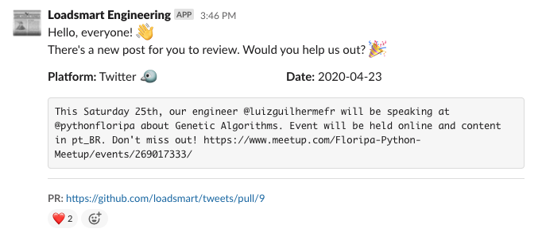

Together with [launching](https://engineering.loadsmart.com/blog/hello-world/) our blog, we have recently created (or better: _reactivated_) our Engineering team’s Twitter account. We are planning to use it as the default broadcaster for the work we do at Loadsmart. And although we may have different channels (as this blog itself) and possibly different forms of content, Twitter is great at notifying what’s new, regardless of form or platform.

However, one of the biggest concerns I had when we started the idea of sharing our work was to not let our account be managed by a single person or a small group in the company. Having specific people responsible for creating those tweets would likely create bottlenecks that could lead to lack of engagement in generating new content. And to make this initiative successful, we need to make sure content creation comes from everyone. It should be accessible to anyone willing to contribute to it. I believe this is what creates a collective sense of ownership.

## The problem

Twitter is a [microblogging](https://en.wikipedia.org/wiki/Microblogging) platform so I thought: "Why not having a similar experience from regular blogs where multiple authors write multiple articles?". Well, that would be nice. But unfortunately, different from regular blogs, we can only post content from a single account.

The easiest solution would be sharing the credentials, some may think. That would work but that only wouldn’t be enough. Collective ownership is also about making sure decisions are made and agreed upon. We would need at least people reviewing each other’s content.

So thinking a bit more, what I envisioned was a flow that would allow us to:

1. have someone proposing a new tweet
2. notify others when there’s new content to be reviewed
3. have others reviewing and approving it
4. publish tweet when content is approved

## The solution

Because these reviewers are mostly engineers, the closer this whole process is from their natural habitat, the better. We use GitHub and Slack all day so the solution would definitely be somewhere in there.

I have used [Danger](https://danger.systems/js/) and [Peril](https://github.com/danger/peril) quite a lot in the past. It’s a great tool to automate many of the workflows we have, especially when it comes to review of Pull Requests. In fact, Loadsmart has its own set of [settings](https://github.com/loadsmart/peril-settings) that are used across many of our repositories on GitHub. But this time I decided to give GitHub actions a try.

Surprisingly, most of the things I was planning to implement were already done by [Gregor Martynus](https://github.com/gr2m) in their [twitter-together](https://github.com/gr2m/twitter-together) project. From the steps of the diagram above, the Action takes care of 1, 2 and 4. The only step missing here is the Slack notification.

There are a few Actions to interact with Slack in the marketplace. They are all very similar to each other and it seems to me that the same problem was solved multiple times (thinking out loud, it would be good if GitHub had a way to make Actions "official"). So I decided to implement this step myself. I would have to create a custom action in the end to glue all the work together (passing to Slack the content of the tweet in the PR) so this would be only an extra step. By the way, their [Block Kit API](https://api.slack.com/block-kit) is very flexible and you can build interesting custom notifications:

The example above presents a notification for a [Pull Request](https://github.com/loadsmart/tweets/pull/9) that after opened (and [identified](https://github.com/loadsmart/tweets/pull/9/checks?check_run_id=613179583) as a valid tweet-type PR), sends a message to our team asking for reviews. Once approved, it gets merged into [master](https://github.com/loadsmart/tweets/runs/613204451?check_suite_focus=true) and then finally [tweeted](https://twitter.com/LoadsmartEng/status/1253412556867203073).

For the complete workflow, check the project we have just open-sourced at [https://github.com/loadsmart/tweets](https://github.com/loadsmart/tweets)
