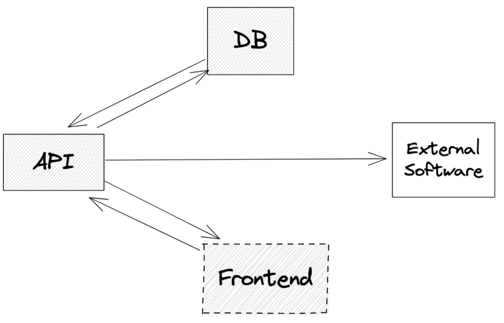

At Loadsmart, the [hiring process](https://github.com/loadsmart/culture/blob/main/hiring/interviewing.md) consists of four steps:
A screening interview, with one of our recruiters, a coding exercise, done through HackerRank, a system’s design interview, and, finally, a soft-skills interview.
But what to expect from a system’s design interview, and how to succeed on it?
First of all, the system’s design, also known as the “architectural” interview has slightly different formats depending on the position you are applying for.
It will, however, always require you as a candidate to explain how you would approach a given problem, proposing a solution and then iterating over it as more requirements or variables are added.
It usually comes with a whiteboard so you can visually explain your thoughts and keep track of what you’ve built so far.
We evaluate not only your technical acumen but also your communication and ability to explain your ideas, according to the seniority of the position you have applied to.
There are no right or wrong answers, but there are solutions that would work all the time, there are solutions that could work most of the time and there are solutions that would not work at all.
Here are 5 tips for you to convince the interviewer your solution falls under the first case.

### Tip 1: Pay attention to the problem scope

One of the most common mistakes candidates make on architectural interviews is to go beyond what was asked in the problem statement.
Imagine that the scope is closed, every requirement is there.
Later on, more variables and requirements will be added, so we will evaluate your ability to adapt your solution to this new scenario.
Adding by yourself new requirements to the problem might indicate that you are not comfortable with the actual requirements and are trying to run away from them.
So the first tip is: Stick to the problem scope.

### Tip 2: Do not over-engineer

We want to evaluate your ability to create complex systems, but also simple ones.
In a real-world scenario, you would unlikely start a project with dozens of servers and top-notch tools to intercommunicate them.
Start lean, paying attention to the scope, and then evolve your solution as variables such as requests per minute are added.
If you’re in doubt, ask the interviewer.

### Tip 3: Understand what you are proposing

In our industry, we are bombarded with new technologies each day, but if you pay attention, just a few of them really lasts.
If you propose using a technology X, Y, or Z, you are expected to explain why you think this technology is appropriate beside any personal preference.
This is what differentiates someone who knows that a tool exists from those who really understand the pros and cons of using it against an alternative.
You don’t need to be an expert on the low-level implementation of every technology, but in a real-world scenario, you would have to convince your peers why using X is better than Z for _that specific problem_.

### Tip 4: Be decisive

If you can incorporate the 3rd tip this one will be easy.
We certainly have a lot of possibilities to solve each problem, but it is your role to decide on what is best and explain why.
Your final answer cannot be “we could use X… or even Y… or perhaps Z”.
Demonstrate confidence in saying “we should use Y for this problem because of this and that”.
There are cases that more than one solution applies, and that’s OK.
If you don’t know what to use, that’s perfectly fine, be honest and tell the interviewer you would need deeper research on the topic.
No one knows everything, and neither do interviewers, that’s why we need you to precisely explain the reasons that brought you to think the way you do.

### Tip 5: Don’t be afraid to think

We do not expect you to have all the answers on the top of your head.
Sometimes you will need more time to think about the variables and circumstances your problem is subject to, and then decide how to tackle it.
Take your time to reflect on the possibilities, and then explain the rationale behind your answer.
The interviewer will not rush you.

### Final remarks

Hopefully, these tips will help you extract your best during the interview, which I can assure is a fun and friendly meeting.
Remember it is not only about the _hard_ skills, but also the _soft_ ones, so take advantage of this challenge to exercise your communication, teach and learn new things.
If you think I forgot something, feel free to use the comments section and share your tips too, I’m sure it’ll help someone.

Felt interested after those tips?
Take a look at our [careers page](https://jobs.lever.co/loadsmart) for our open opportunities, and good luck!
