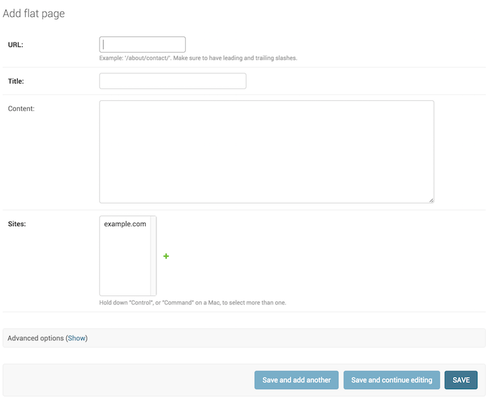

Have you ever noticed some Django admin page taking a long time to load? Maybe even ending in a timeout (http 504)?



This kind of issue should be uncommon in small, earlier projects. However, if it starts to happen and gets worse over time, one possible cause is that some of that entity’s relationships are editable on the page, which causes Django to fetch all instances in the database to populate the dropdown list.

### Use `readonly_fields`

In this situation, the easiest solution would be to just set those fields as [`readonly_fields`](https://docs.djangoproject.com/en/4.1/ref/contrib/admin/#django.contrib.admin.ModelAdmin.readonly_fields) in the page definition.

```python
class CustomAdmin(admin.ModelAdmin):
    readonly_fields = (
        "some_field", # ForeignKey with lots of instances
    )
```

With it, the field will be rendered on the admin page just as its current value, statically.

## Must be editable?

If having a foreign key as an editable field on the admin is a must for your use case, consider these options:

### Use `raw_id_fields`

Setting the field as a [raw id field](https://docs.djangoproject.com/en/4.1/ref/contrib/admin/#django.contrib.admin.ModelAdmin.raw_id_fields) still allows its editing as just the id value of the related entity:

```python
class CustomAdmin(admin.ModelAdmin):
    raw_id_fields = (
        "some_field", # ForeignKey with lots of instances
    )
```

It will render an input field on the admin with the possibility of opening a popup to search for the desired instance

### Use custom filters

Filtering its queryset to a smaller, more specific, set of instances, like the example mentioned in [Django ticket #28311](https://code.djangoproject.com/ticket/28311):

```python
class CustomForm(forms.ModelForm):
    def __init__(self, *args, **kwargs):
        super().__init__(*args, **kwargs)
        self.fields["some_field"].queryset = self._get_field_queryset()

    def _get_field_queryset(self):
        return SomeField.objects.filter(...)


class CustomAdmin(admin.ModelAdmin):
    form = CustomForm
```

In this case, you’d still have the editable field on admin as a dropdown, but with a smaller impact to its rendering performance.
