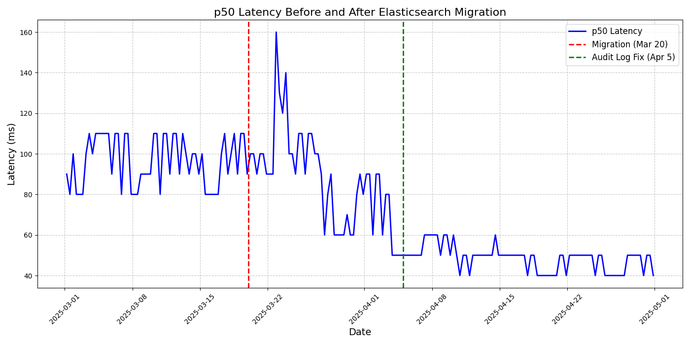

At Loadsmart, Elasticsearch is a mission-critical resource that powers search functionality across multiple teams and applications. From helping shippers find available loads to enabling internal teams to query operational data efficiently, it plays a central role in delivering fast, reliable access to the data our business depends on.

This post walks you through our migration from AWS Elasticsearch to Elastic Cloud, the “why”, the challenges, the wins, and the lessons we wish we’d known earlier.

# The Fork in the Road: Why Migrate at All?

Back in 2021, Elastic shifted its software offerings from Apache 2.0 to dual-licensed under Server Side Public License (SSPL) and the Elastic License. With this move, a significant software suite, including Elasticsearch and Kibana, was changed to a more restrictive license model.

AWS responded by forking the codebase and launching [OpenSearch](https://aws.amazon.com/blogs/opensource/introducing-opensearch/).

That put Loadsmart and many other companies at a crossroads:

* **Stay on AWS Elasticsearch**: But remain stuck on version 7.10 forever.
* **Adopt OpenSearch**: But rewrite some code and adapt to a diverging ecosystem.
* **Move to Elastic Cloud**: Keep on ElasticSearch, avoid fragmentation, and stay updated.

We chose the third option, and here’s why:

After extensive research and careful review, Elastic Cloud checked the right boxes:

✅ Maintain compatibility with our existing Python clients and APIs.

✅ Access to newer versions offering security patches, bug fixes, and performance improvements.

✅ A fully managed service maintained by the core developers of Elasticsearch
Supported by [public benchmarks](https://www.elastic.co/blog/elasticsearch-opensearch-performance-gap), there’s a clear and significant performance gap between Elasticsearch and OpenSearch, particularly at scale.

✅ OpenSearch only seemed cheaper because we ran it on a legacy Elasticsearch engine; moving to the official fork would roughly double resource needs, an 8 GB Elastic Cloud node would need about 16 GB on OpenSearch, erasing any savings, as Elastic Cloud’s [pricing calculator](https://cloud.elastic.co/pricing) confirms.

# How We Made It Happen

## Planning & Project Scope

This cross-team effort between the Platform team and Product Engineering teams was centered on migrating production and staging Elasticsearch clusters without disrupting users. We deliberately excluded major refactoring, OpenSearch support, or early adoption of Elasticsearch 8, choosing instead to focus on a safe, incremental shift.

The Platform team engaged with the Product Engineering teams, set shared expectations, and kept everyone informed via Slack updates and weekly check-ins. Clear success metrics helped us track progress across environments.

## Automation and Safety First

The migration strategy emphasized automation and rollback capabilities. We used [Elastic Curator](https://github.com/elastic/curator) to take hourly [snapshots](https://www.elastic.co/docs/deploy-manage/tools/snapshot-and-restore) and built robust Python workflows for restoration, validation, and data consistency checks.

Instead of manual checks, we built automated validations to compare document counts, field mappings, and shard layouts across clusters. Although Elasticsearch snapshots already ensure consistency, we added these extra controls to catch any writes that might slip in during the cutover. If anything was off, our pre-migration snapshots were ready for a rollback–a safety we didn’t end up needing, but one that gave us confidence throughout the process.

## The Migration in Action

We strictly followed a playbook:

1. Pause the worker queue writing to the cluster.
2. Block new writes to the original AWS OpenSearch endpoints.
3. Create and restore the latest snapshot to Elastic Cloud.
4. Verify data accuracy and completeness without interrupting reads.
5. Update app secrets to point to the new cluster.
6. Restart the worker queue.

The queue grew briefly as the system continued reading from the legacy cluster. Once the secret was updated to point to the new cluster, writes seamlessly shifted over. No downtime, no issues. This smooth transition was possible because the application uses an asynchronous routine to write to the cluster, allowing it to buffer and retry without blocking the main flow.

## Performance Gains

After migrating the search service to the new Elastic Cloud cluster, we saw immediate and measurable improvements. Most notably, the p50 latency (median response time) for one of our highest-traffic endpoints dropped dramatically.

As shown in the chart below, before the migration on March 20, the p50 latency typically hovered around 90ms. After the migration, and especially following the resolution of an audit log issue in early April, latency dropped significantly to around 40ms, with reduced variability and improved stability.

This performance gain is a direct result of the improved infrastructure and optimized query execution on the new cluster. The migration not only ensured continuity with no downtime but also delivered a tangible improvement in request performance.

But the benefits go beyond just speed: 

* **Single Sign-On (SSO) with Kibana**: Built-in SSO support with enterprise identity providers improves security and simplifies access management.

* **Specialized Support**: One of the key advantages is having direct support from the creators of Elasticsearch, including Service Level Agreements (SLAs) and priority response times, ensuring faster issue resolution and peace of mind.

* **Effortless Upgrades**: Stay current with the latest features and security patches through automatic, zero-downtime upgrades, which require no manual effort.

* **Advanced Monitoring and Observability**: Real-time insights via AutoOps make tracking system performance, health, and usage patterns easier.

* **Reduced Operational Overhead**: Elastic Cloud’s autoscaling and built-in performance tuning make operations more straightforward and predictable.

## Final Thoughts

Migrating to Elastic Cloud was more than a version upgrade–it was a strategic move forward in stability, performance, and operational simplicity. By moving off AWS Elasticsearch and onto Elastic’s managed service, we positioned ourselves to scale smarter, innovate faster, and operate more securely.

Throughout the migration, we focused on automation, cross-team coordination, and risk mitigation. The results? Zero downtime, significantly improved latency, and a future-proofed foundation for more advanced use cases like vector search and real-time observability.

We are excited to take advantage of the newest features. Just as important, we’re carrying forward the lessons from this migration, which will shape how we approach future projects, system upgrades, and architectural evolution.

## Key Takeaways

The migration highlighted several best practices and lessons that proved critical to its success:

* **Safety nets provide confidence**: Having rollback capabilities and automated validations gives teams confidence to proceed without fear of data loss.

* **Use proven tools**: Leverage established tools like Elastic Curator for snapshots and restoration workflows.

* **Emphasize automation over manual processes**: Build automated validation workflows instead of relying on manual checks to ensure consistency and reduce human error.

* **Follow a strict playbook**: Document and follow a detailed migration process to ensure consistency and reduce mistakes.

* **Cross-team collaboration is crucial**: Involve both Platform and Product Engineering teams early and maintain clear communication throughout the process.

* **Be mindful of cost implications**: Cloud migration can increase costs depending on the chosen support level and instance types—review and adjust these settings to match actual needs and avoid unnecessary spending.

If you faced similar or different challenges when choosing Elasticsearch options, we'd love to hear from you and share knowledge.

## Reference
[Curator and index lifecycle management | Elastic docs](https://www.elastic.co/docs/reference/elasticsearch/curator)

[Snapshot and restore | Elastic docs](https://www.elastic.co/docs/deploy-manage/tools/snapshot-and-restore)

[Elasticsearch Python Client documentation](https://elasticsearch-py.readthedocs.io/en/v9.0.2/)

